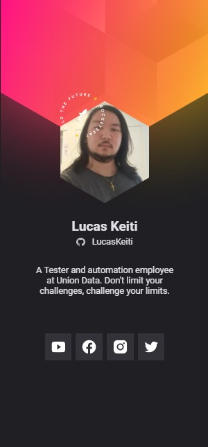

## NLW Heat Origin - Virtual Badge

  <a href="#-sobre-o-projeto">Projeto</a>&nbsp;&nbsp;&nbsp;|&nbsp;&nbsp;&nbsp;
  <a href="#tecnologias">Tecnologias</a>&nbsp;&nbsp;&nbsp;|&nbsp;&nbsp;&nbsp;
  <a href="#-licença">Licença</a>

 

  

## 💻 Sobre o Projeto

A NLW Heat Origin - Virtual Badge é o desenvolvimento de um crachá virtual envolvendo a customização do seu próprio perfil do GitHub com fácil direcionamento/visualização de suas redes sociais e demais plataformas.

## 🔍Tecnologias

- HTML
- CSS
- JavaScript

## 📝 Licença
Esse projeto está sob a licença MIT. Veja o arquivo [LICENSE](LICENSE) para mais detalhes.

### 👔 Link para visualização Web

https://lucaskeiti.github.io/custom-profile/

### 📰 Como clonar o projeto

git clone https://github.com/LucasKeiti/custom-profile.git

Realizar o comando do git clone para clonar o projeto em seu repositório e dentro do arquivo "main.js", basta alterar as variáveis da const LinksSocialMedia.

---

🌀 Linkedin: https://www.linkedin.com/in/lucas-keiti-8a93a3231/

Autor: Lucas Keiti
